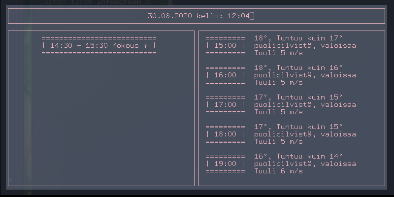

# Sulautetut järjestelmät 
Sulautetut järjestelmien kurssia varten repositorio.

## Kansio rakenne
```Directory
.
├── arduino
│   ├── harjoitus1
│   │   └── main
│   │       └── main.ino
│   ├── harjoitus10
│   │   └── main
│   │       └── main.ino
│   ├── harjoitus2
│   │   └── main
│   │       └── main.ino
│   ├── harjoitus5
│   │   └── main
│   │       └── main.ino
│   ├── harjoitus6
│   │   └── main
│   │       └── main.ino
│   └── library
│       ├── LedMatrix
│       │   ├── LedMatrix.cpp
│       │   └── LedMatrix.h
│       ├── Morse
│       │   ├── Morse.cpp
│       │   └── Morse.h
│       ├── Snake
│       │   ├── Containers.h
│       │   ├── Snake.cpp
│       │   └── Snake.h
│       └── sort
│           └── sort.h
├── bash
│   ├── code.sh
│   └── script.sh
├── python
│   ├── infoscreen
│   │   ├── getCalendar.py
│   │   ├── install.sh
│   │   ├── requirements.txt
│   │   ├── screen.py
│   │   ├── start.sh
│   │   └── weather.py
│   ├── readSerial.py
│   ├── show-cpu.py
│   ├── tehtava1.py
│   ├── tehtava2.py
│   └── tehtava3.py
└── README.md
```

## 1. Ohjelmointi
**Python** kansiosta löytyy python harjoitukset

## 2. Käyttöjärjestelmät
**Bash** kansiosta löytyy liittyvät scriptit code.sh ja script.sh

## 3. Arduino
**.Ino** päätteiset tiedostot löytyvät kansiosta arduino. Tehdyt kirjastot on kansiossa **arduino/library**

## 4. Projekti
Kansiossa **python/infoscreen**. Sisältää myös asennus **bash** scriptin, sekä käynnistys scriptin.

### 4.1 Mistä
Yksinkertainen **python-curses** pohjautuva ohjelma, joka näyttää kellon, sään, sekä kalenteri tapahtumat. Suunniteltu noin 800x600 kokoiselle näytölle, joka on yksi värinen. Näkymän voi sulkea painamall q ja päivittää tiedot painamalla r. Tämän lisäksi ohjelma vaatii .env nimisen tiedoston jossa on muuttujat **WEATHER_URL** ja **CAL_URL**.

Esim.
```
WEATHER_URL=https://www.ilmatieteenlaitos.fi/saa/helsinki
CAL_URL=http://<some-calendar>/calendar.ics
```
